# **UE4 Google Speech Kit**


This is UE4 wrapper for Google's [Cloud Text-to-Speech](https://cloud.google.com/text-to-speech/) and syncronous [Cloud Speech-to-Text](https://cloud.google.com/speech-to-text/) speech recognition.

Plugin was battle tested in several commercial simulator projects. It is small, lean and simple to use.

# Table of contents
1. [Engine preparation](#engine-preparation)
1. [Cloud preparation](#cloud-preparation)
1. [Speech synthesis](#speech-synthesis)
1. [Speech recognition](#speech-recognition)
    1. [Voice capture](#voice-capture)
    1. [Listing available capture devices](#listing-available-capture-devices)
1. [Utilities](#utilities)
1. [Supported platforms](#supported-platforms)
1. [Migration guide](#migration-guide)
1. [Useful links](#links)

# Engine preparation

To make microphone work, you need to add following lines to `DefaultEngine.ini` of the project.
```
[Voice]
bEnabled=true
```

To not loose pauses in between words, you probably want to check silence detection treshold `voice.SilenceDetectionThreshold`, value `0.01` is good.
This also goes to `DefaultEngine.ini`.

```
[SystemSettings]
voice.SilenceDetectionThreshold=0.01
```
Starting from Engine version 4.25 also put
```
voice.MicNoiseGateThreshold=0.01
```

Another voice related variables worth playing with
```bash
voice.MicNoiseGateThreshold
voice.MicInputGain
voice.MicStereoBias
voice.MicNoiseAttackTime
voice.MicNoiseReleaseTime
voice.MicStereoBias
voice.SilenceDetectionAttackTime
voice.SilenceDetectionReleaseTime
```

To find available settings type `voice.` in editor console, and autocompletion widget will pop up.

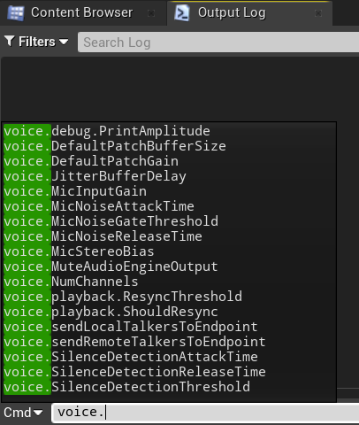

Console variables can be modified in runtime like this


To debug your microphone input you can convert output sound buffer to
unreal sound wave and play it.

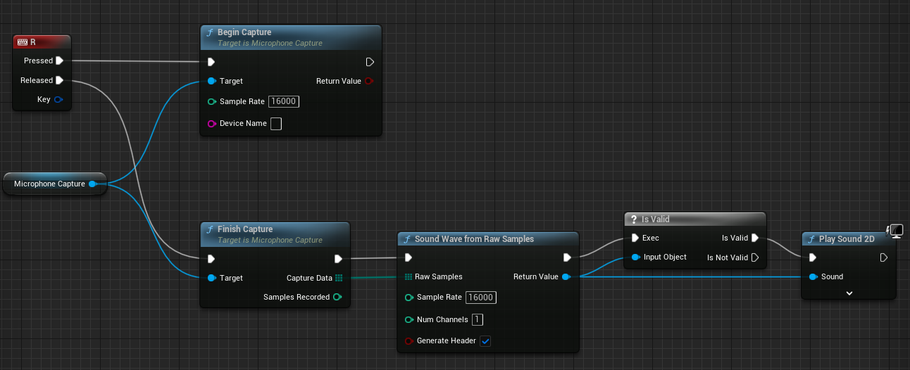

Above values may differ depending on actual microphone characteristics.

# Cloud preparation
1) Go to [google cloud](https://console.cloud.google.com) and create payment account.
2) Enable [Cloud Speech-to-Text API](https://console.cloud.google.com/apis/library/speech.googleapis.com) and [Cloud Text-to-Speech API](https://console.cloud.google.com/apis/library/texttospeech.googleapis.com).
3) Create credentials to access your enabled APIs. See instructions [here](https://cloud.google.com/docs/authentication).


4) There are two ways how you can use your credentials in project.

    * 4.1 By using environment variables. Create environment variable `GOOGLE_API_KEY` with created key as value.

    * 4.2 By assigning key directly in blueprints. This can be called anywhere.

    

    By default you need to set api key from nodes. To use environment variable, you need to set `Use Env Variable` to `true`.

> **ADVICE**: Pay attention to security and encrypt your assets before packaging.


# Speech synthesis

You need to supply text to async node, as well as voice variant, speech speed, pitch value and optionally audio effects. As output you will get
sound wave object which can be played by engine.


<!-- ## Bonus!

Output raw samles can be used with oculus ovr lipsync in runtime.


Get node [here](https://github.com/IlgarLunin/UE4OVRLipSyncCookFrameSequence).

Demo:

[](https://www.youtube.com/watch?v=B78aQly2wrI) -->

# Speech recognition

Consists of two parts. Voice capture, and sending request. There are two ways how you can capture your voice, depending on your needs.

<!-- WINDOWS -->
<details>
  <summary>Windows only (deprecated)</summary>
  

Use provided **MicrophoneCapture** actor component as shown below. Next, construct recognition parameters and pass them to **Google STT** async node.


</details>

---

<!-- MAC -->
<details>
  <summary>Windows and Mac (use this method)</summary>

1. First, we need to give our project microphone access.
    1. In Xcode, select you project
    1. Go to `Info` tab
    1. Expand `Custom macOS Application Target Properties` section
    1. Hit `+`, and add `Privacy - Microphone Usage Description` string key, set any value you want, for example "GoogleSpeechKitMicAccess" 
    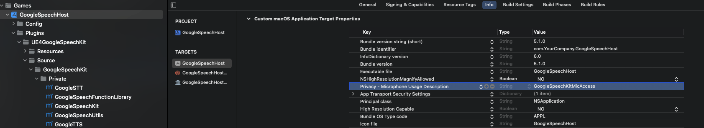

1. Create SoundMix.
    1. Right click in content browser - `Sounds > Mix > Sound Soundmix`
    1. Open it, and set output value to -96.0
    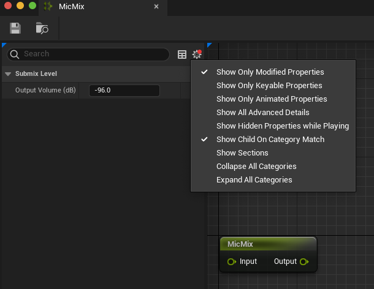

1. Create sound class
    1. Right click in content browser - `Sounds > Classes > Sound Class`
    1. Open it, and set our submix that we created in previous step as sound class default submix

1. Make sure Audio Capture plugin is enabled
    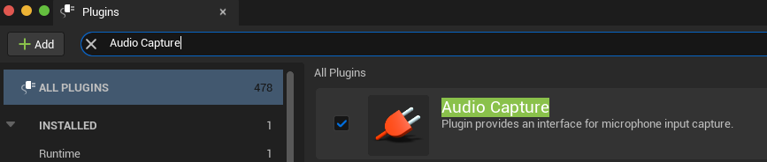
1. Go to your actor, and add AudioCapture component in components tab
1. Disable "Auto Activate" option on AudioCapture
1. Set our sound class to AudioCapture
    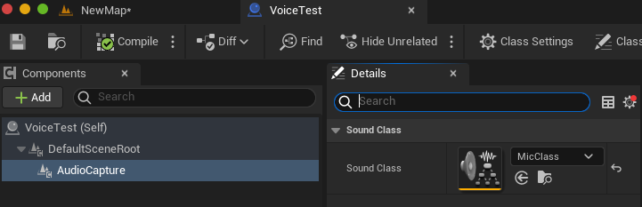

1. Now we can drop some nodes. In order to start and stop recording, we use `Activate` and `Deactivate` nodes with previously added AudioCapture component as a target. When audio capture is activated, we can start recording output from our submix
1. When audio capture is deactivated, we finish recording output to `Wav File`! **This is important**! Give your wav file a name (e.g. "stt_sample"), `Path` can be absolute, or relative (to the /Saved/BouncedWavFiles folder)
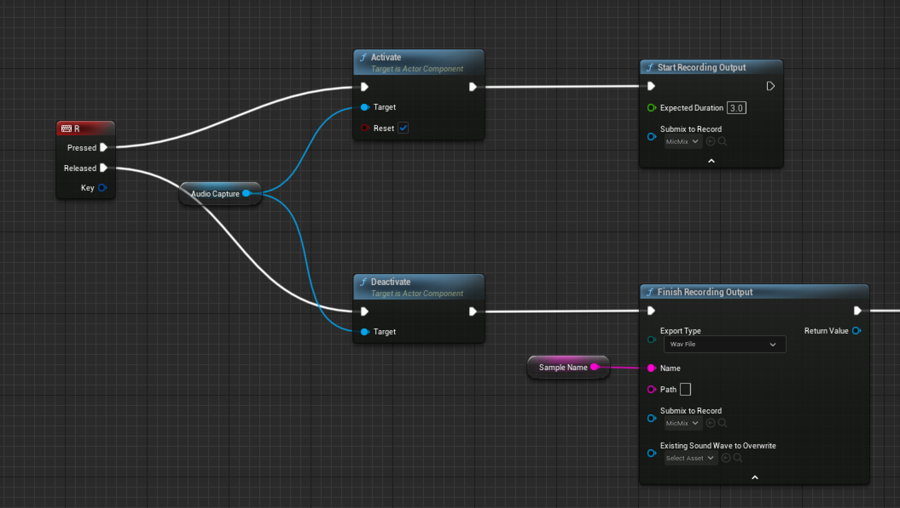
1. Then, after small delay, we can read saved file back as byte samples, ready to be fed to `Google STT` node
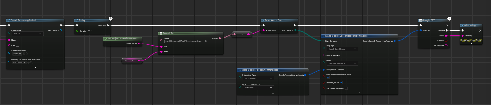

</details>

---


There is another STT node - **Google STT Variants** node. Which, instead of returning result with highest confidence, returns an array of variants.


# Utilities
## Percentage based string comparison (Fuzzy matching)

Probably, you will need to process recognised voice in your app, to increase recognition chances use `CompareStrings` node. Below call will return 0.666 value,
so we can treat those strings equal since they are simmilar on 66%. Utilizes [Levenstein distance](https://en.wikipedia.org/wiki/Levenshtein_distance) algorithm


## Listing available capture devices

You can pass microphone name to microphone capture component. To get list of available microphones, use following setup

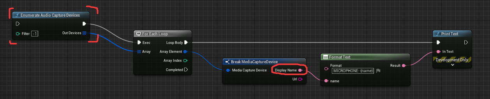

# Supported platforms

**Windows** and **Mac**.

# Migration guide
<details>
<summary>Version 3.0</summary>

`EGoogleTTSLanguage` was removed. You need to pass [voice name](https://cloud.google.com/text-to-speech/docs/voices) as string (**Voice name** column).

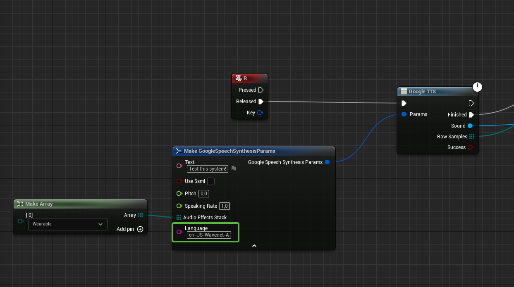

> **WARNING**: Since synthesys parameters has changed, TTS cache is no longer valid! Make sure you remove TTS cache if exists. **Editor/Game can freeze** if old cache wll be loaded. So make sure to remove `PROJECT_ROOT/Saved/GoogleTTSCache` folder. Or invoke `WipeTTSCache` node before GoogleTTS node is executed!

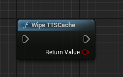

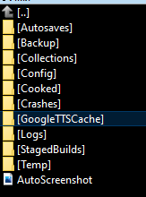

The reason for this is that the number of languages has exceeded 256, and we can't put this amount into 8 bit enums (This is Unreal's limitation)


</details>

# Links
Find out more in documentation for corresponding sections.
* [Supported TTS voices](https://cloud.google.com/text-to-speech/docs/voices) ([WaveNet](https://en.wikipedia.org/wiki/WaveNet) are the best)
* [Speech synthesis config](https://cloud.google.com/text-to-speech/docs/reference/rest/v1/text/synthesize#audioconfig)
* [Supported STT languages](https://cloud.google.com/speech-to-text/docs/languages)
* [Speech recognition config](https://cloud.google.com/speech-to-text/docs/reference/rest/v1/RecognitionConfig)
