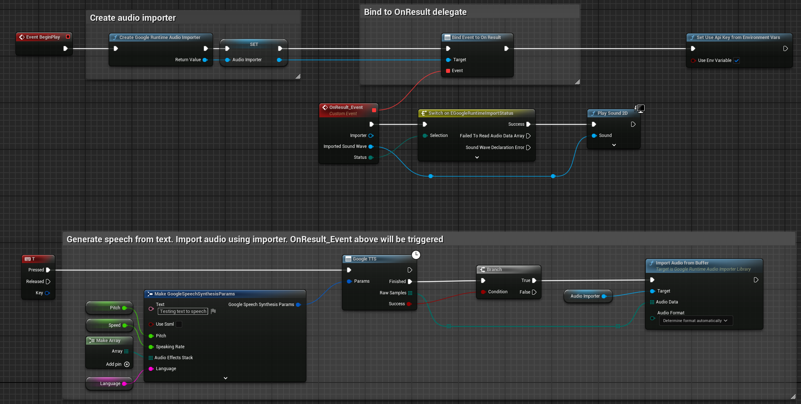

# **UE4 Google Speech Kit**


This is UE4 wrapper for Google's [Cloud Text-to-Speech](https://cloud.google.com/text-to-speech/) and syncronous [Cloud Speech-to-Text](https://cloud.google.com/speech-to-text/) speech recognition.

Plugin was battle tested in several commercial simulator projects. It is small, lean and simple to use.

# Preparation
1) Go to [google cloud](https://console.cloud.google.com) and create payment account.
2) Enable [Cloud Speech-to-Text API](https://console.cloud.google.com/apis/library/speech.googleapis.com) and [Cloud Text-to-Speech API](https://console.cloud.google.com/apis/library/texttospeech.googleapis.com).
3) Create credentials to access your enabled APIs. See instructions [here](https://cloud.google.com/docs/authentication).


4) There are two ways how you can use your credentials in project.

    * 4.1 By using environment variables. Create environment variable `GOOGLE_API_KEY` with created key as value.

    * 4.2 By assigning key directly in blueprints. This can be called anywhere.

    

    By default you need to set api key from nodes. To use environment variable, you need to set `Use Env Variable` to `true`.

> **ADVICE**: Pay attention to security and encrypt your assets before packaging.


# Speech synthesis

You need to supply text to async node, as well as voice variant, speech speed, pitch value and optionally audio effects. As output you will get
sound wave object which can be played by engine.



## Bonus!

Output raw samles can be used with oculus ovr lipsync in runtime.


Get node [here](https://github.com/IlgarLunin/UE4OVRLipSyncCookFrameSequence).

Demo:

[](https://www.youtube.com/watch?v=B78aQly2wrI)

# Speech recognition

Consists of two parts. First, we need to record voice from microphone. To do that, use provided **MicrophoneCapture**
actor component as shown below. Next, construct recognition parameters and pass them to **Google STT** async node.


Another way to perform recognition is to use **Google STT Variants** node. Which, instead of returning result with highest confidence, returns an array of variants.


Probably you will need to send voice commands to you app, to increase recognition chances use `CompareStrings` node. Below call will return 0.666 value,
so we can treat those strings equal since they are simmilar on 66%.


# Important steps

To make microphone work, you need to add following lines to `Engine.ini` of the project.
```
[Voice]
bEnabled=true
```

To not loose pauses in between words, you probably want to check silence detection treshold `voice.SilenceDetectionThreshold`, value `0.01` is good.
This also goes to `Engine.ini`.

```
[SystemSettings]
voice.SilenceDetectionThreshold=0.01
```
Starting from Engine version 4.25 also put 
```
voice.MicNoiseGateThreshold=0.01
```

Or by executing console command during runtime


# Platforms supported

**Windows** and **Mac**.

# Links
Find out more in documentation for corresponding sections.
* [Supported TTS voices](https://cloud.google.com/text-to-speech/docs/voices) ([WaveNet](https://en.wikipedia.org/wiki/WaveNet) are the best)
* [Speech synthesis config](https://cloud.google.com/text-to-speech/docs/reference/rest/v1/text/synthesize#audioconfig)
* [Supported STT languages](https://cloud.google.com/speech-to-text/docs/languages)
* [Speech recognition config](https://cloud.google.com/speech-to-text/docs/reference/rest/v1/RecognitionConfig)
